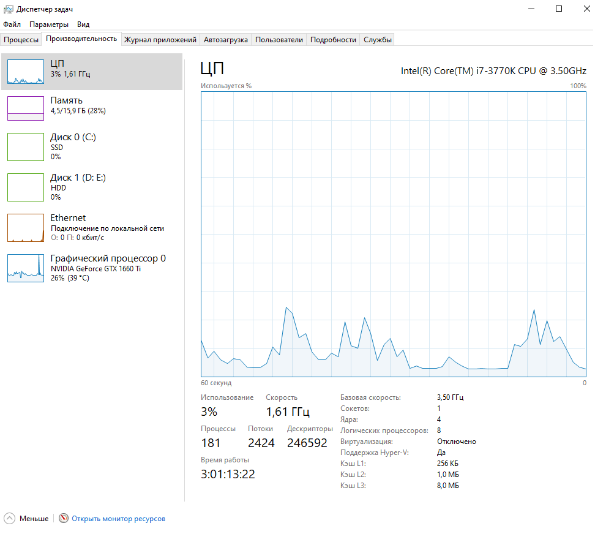

# Отчет
Перед началом всех измерений зафиксируем работу компьютера в обычном состоянии,
а также запишем ссылки в текстовый документ с помощью io_bound_init_urls.py

# IO-bound
## IO-bound sync
Замерим время синхронной проверки ссылок через io_bound.py
Затраченное на это время составило около 23 минут

По отчёту можно понять, что пропускная способность синхронной работы
составила около 32 кбит/с на отправку запроса и 776 кбит/с на получение ответа
по интернету, остальные показатели значительно не изменились

## IO-bound async 5 threads
Время асинхронной проверки ссылок через io_bound_threading.py при 5 рабочих потоках
составило около 5 минут, причём пропускная способность повысилась до 96 кбит/c отпр.
и 2.3 Мбит/с получ.

## IO-bound async 10 threads
Асинхронная проверка при 10 потоках составила около 3 минут. Пропускная способность
200 кбит/c отп. 3.3 Мбит/с получ.

## IO-bound async 100 threads
Асинхронная проверка при 100 потоках составила около 2 минут. Пропускная способность
360 кбит/c отп. 4.5 Мбит/с получ.

## IO-bound вывод
По итогу можно понять, что при использовании ThreadPoolExecutor повышение кол-ва потоков, 
которые запрашивают данные по сети, понижает суммарное время ожидания всех ответов,
а также повышает общую пропускную способность запросов через интернет. 
Иные показатели особо не изменяются

# CPU-bound
## CPU-bound sync
Замерим скорость генерации монетки на 1 ядре с помощью cpu_bound.py
Врмя получения одной монетки составили около 1-2 минут

Можно заметить, что процент загрузки процессора возрос до 20% (3% изнач.),
а скорость повысилась до 3.89ГГц (1.61ГГц изнач.)

## CPU-bound async 2 proc
Теперь попробуем повторить генерацию, но уже с двумя процессами 
с помощью cpu_bound_threading.py
Время генерации теперь составило также около 1-2 минут. Сам же процессор
теперь работает на 35%

## CPU-bound async 4 proc
4 процесса, время ожидания значительно понизилось до 22 секунд,
процессор задействован на 60%

## CPU-bound async 5 proc
5 процессов, время ожидания примерно 20 секунд,
процессор задействован на 74%

P.S. Интересно заметить, что в некоторых случаях при работе с 5
потоками получилось получить монетку всего за 2 секунды, что указывает
на присутствие элемента удачи при генерации монеток

## CPU-bound async 10 proc
При 10 процессах процессор задействует все свои ядра и работает
на 100% с максимальной скоростью. Итоговое время генерации монетки получилось
равным 9 секундам

## CPU-bound async 61 proc
Поставим максимальное значение - 61 процесс, которое допускает ProcessPoolExecutor.
В итоге процессор также работает на 100% с максимальной скоростью. Итоговое время - 11 секунд
Видно, что ставить процессов больше, чем позволяет сам процессор не имеет смысла

## CPU-bound вывод
По итогу можно сказать, что использовании ProcessPoolExecutor повышается процент использования
процессора (кол-во его ядер) и его скорость. Также было выявлено, что использование процессов
количеством больше, чем позволяет сам процессор не имеет смысла